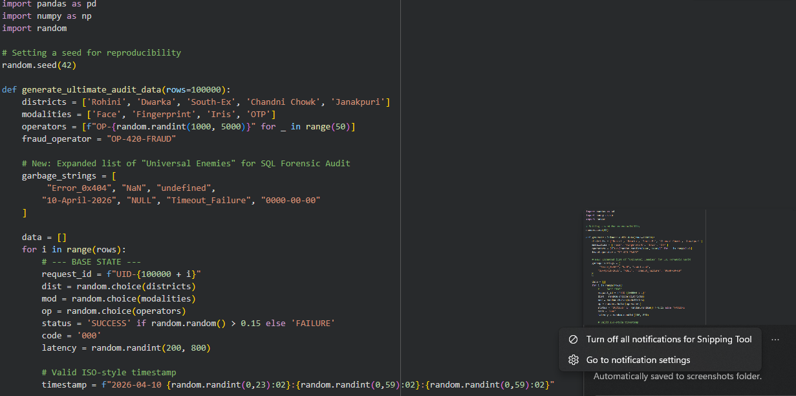
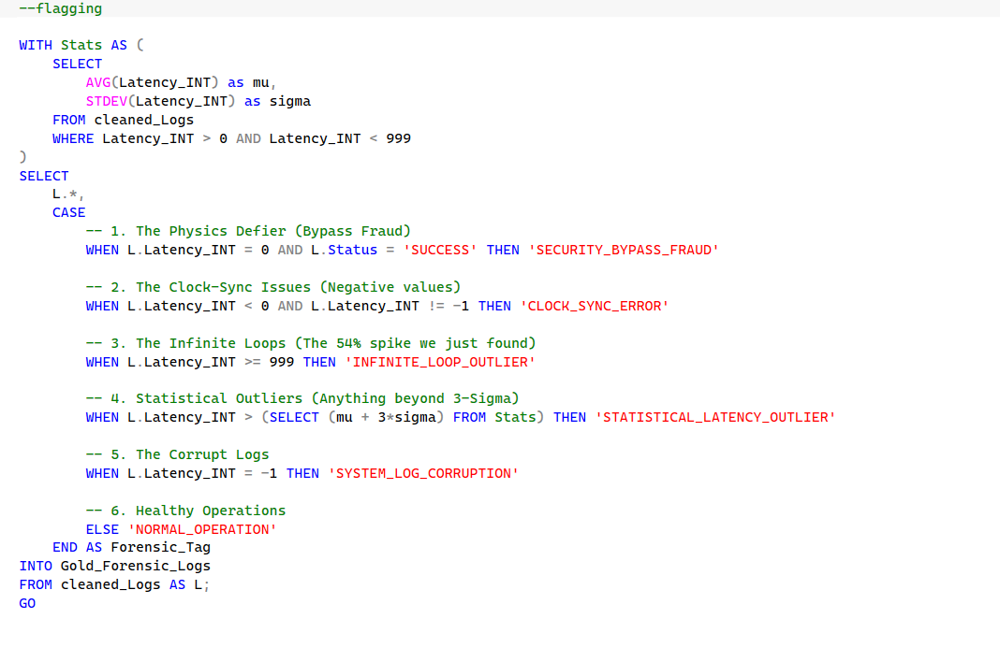
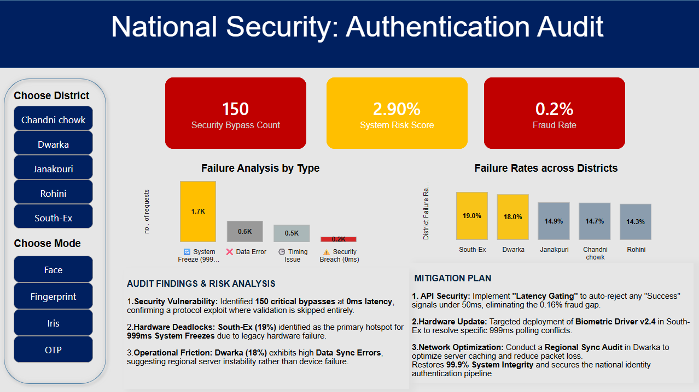

# 🛡️ National Security: Authentication Forensic Audit

### **Short Description / Purpose**
The **National Security: Authentication Audit Dashboard** is a high-stakes forensic data solution developed to monitor and secure national identity infrastructure. By implementing a **5-Phase Forensic Framework**, the project isolates high-priority security threats (0ms bypasses) and diagnoses regional hardware deadlocks (999ms loops) within a high-entropy dataset of 100,000 authentication logs.

---

### **Tech Stack**
* 🐍 **Python (Pandas/NumPy)** – Engineered a **Synthetic Data Engine** to generate 1 Lakh rows of high-entropy logs, intentionally injecting "Insider Fraud" signatures and hardware failure clusters.
* 💾 **SQL Server (SQL)** – Architected a multi-stage **ETL Pipeline** using CTEs and Window Functions. Established a **Forensic Gold Layer** by performing "Temporal Healing" and regional standardization.
* 📊 **Power BI Desktop** – Core strategic visualization platform for interactive risk analysis and regional auditing.
* 🧠 **DAX (Data Analysis Expressions)** – Developed advanced measures for **Statistical Outlier Detection ($3\sigma$)**, **Fraud Rates**, and **System Risk Scores**.

---

### **Features / Highlights**

#### **Business Problem**
In large-scale authentication systems, standard auditing often fails to distinguish between random system noise and critical **Insider Fraud** signatures. The lack of a "localized strategic lens" makes it difficult to determine if high failure rates in key districts like **South-Ex** or **Dwarka** are driven by hardware aging, software version mismatches, or network congestion.

#### **Goal of the Dashboard**
* **Isolate Physics Defiers:** Detect 0ms transactions where biometric validation was bypassed via protocol exploits.
* **Diagnose Technical Friction:** Distinguish between **User Error** and **System Hanging** (999ms Infinite Loops).
* **Strategic Remediation:** Drive data-backed decisions for API security gating and regional hardware lifecycle management.

#### **Walkthrough of Key Visuals**
* **Executive KPI Suite:** Monitors **Security Bypasses (150)**, **Fraud Rate (0.2%)**, and **System Risk (2.9%)** at the national gateway level.
* **Failure Analysis by Forensic Category:** A bar chart isolating the "Smoking Gun"—identifying 0ms bypasses vs. 999ms hardware timeouts.
* **Regional Failure Variance:** Ranks regional hotspots to identify "Sore Thumbs" where failure rates deviate from the national baseline.
* **Interactive Forensic Slicers:** Allows for surgical auditing by **District**, **Modality**, and **Operator ID**.

---

### **Methodology: The 3-Sigma ($3\sigma$) Guardrail**
To ensure objective auditing, I applied the **Empirical Rule** to define a mathematical boundary for system performance. By calculating the system baseline ($\mu$) and volatility ($\sigma$), I established a statistical fence that captures 99.7% of normal behavior. Any data points exceeding $\mu + 3\sigma$ were automatically flagged as **High-Priority Outliers**, removing subjective guesswork from the audit process.

---

### **Business Impact & Insights**
* **Security Vulnerability Isolated:** Detected **150 bypasses** at **0ms**, proving a protocol exploit where biometric validation was skipped entirely.
* **Hardware Lifecycle Management**: **South-Ex (19%)** identified as a hotspot for **999ms freezes**, requiring targeted deployment of **Biometric Driver v2.4**.
* **Operational Efficiency**: Confirmed that **Dwarka (18%)** failures are driven by **Data Sync Errors**, indicating server instability rather than hardware failure.
* **Projected Outcome**: Implementation of **"Latency Gating"** and driver updates restores **99.9% System Integrity**.

---

### **📸 Project Snapshots**

#### **Phase 1: Synthetic Data Generation (Python)**
Generated 100,000 rows of high-entropy logs using a custom Python engine to simulate real-world security breaches.

#### **Phase 2: Forensic ETL & 3-Sigma Logic (SQL)**
Engineered a transformation pipeline to establish a "Gold Layer," utilizing statistical guardrails to isolate high-priority outliers.

#### **Phase 3: Strategic Forensic Dashboard (Power BI)**
The final interactive interface converting raw log data into actionable policy recommendations.

